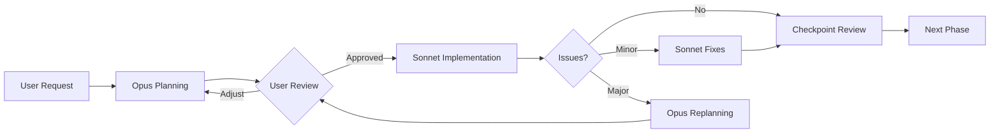

# Collaboration Framework: Opus ↔ Sonnet ↔ User

## Overview

This document defines roles, responsibilities, and interaction protocols between Claude Opus (architect), Claude Sonnet (developer), and the User (product owner) for the agent optimization project.

## Core Principle

**Efficient autonomy with critical control** - Models work independently within defined boundaries, escalating only when necessary.

## Role Definitions

### Claude Opus (Strategic Architect)
**Strengths**: Complex reasoning, architecture design, handling nuanced requirements

**Responsibilities**:
- System architecture and design
- Task decomposition and planning
- Interface definitions
- Critical decision making
- Review at major checkpoints
- Pivot recommendations

**Deliverables**:
- Architecture documents
- Task breakdowns with clear specs
- API contracts
- Decision rationale documentation

### Claude Sonnet (Tactical Developer)
**Strengths**: Efficient coding, following specifications, rapid iteration

**Responsibilities**:
- Module implementation
- Test writing
- Code optimization
- Bug fixing
- Progress reporting
- Issue escalation

**Deliverables**:
- Working code
- Unit and integration tests
- Implementation status reports
- Performance metrics

### User (Product Owner)
**Responsibilities**:
- Vision and requirements
- Critical decision approval
- Resource allocation
- Success criteria definition
- Pivot authorization

## Decision Matrix

### 🟢 Green Zone (Autonomous)
Models decide independently:
- Algorithm selection within modules
- Code structure and naming conventions
- Implementation order within phases
- Performance optimizations
- Library choices from approved list
- Logging and metrics implementation

### 🟡 Yellow Zone (Decide & Notify)
Opus decides, informs User:
- Internal interface modifications
- Function redistribution between modules
- Adding intermediate abstractions
- Simplifications within requirements
- Non-critical trade-offs

**Notification Format**:
```json
{
  "decision": "Simplified config inheritance to single level",
  "reason": "Recursive validation adds 30+ lines complexity",
  "impact": "Covers 95% of use cases",
  "reversible": true
}
```

### 🔴 Red Zone (Requires Approval)
Must get User approval:
- Removing planned functionality
- External API changes
- Technology stack changes
- Data structure modifications (sessions_history.json)
- Scope increase >20%
- Any breaking changes

**Escalation Format**:
```json
{
  "issue": "Parallel experiments conflict with file locking",
  "options": [
    {"id": "A", "solution": "Use Redis queue", "complexity": "high"},
    {"id": "B", "solution": "File locks with retry", "complexity": "medium"},
    {"id": "C", "solution": "Postpone to v2", "complexity": "none"}
  ],
  "recommendation": "B",
  "deadline": "Blocks Phase 2"
}
```

## Communication Protocol

### File-Based Handoff Structure

```
agent-optimization/
├── handoff/
│   ├── opus_to_sonnet/
│   │   ├── current_task.md      # Active task specification
│   │   ├── interfaces.json      # API contracts
│   │   └── constraints.md       # Technical constraints
│   │
│   ├── sonnet_to_opus/
│   │   ├── status.md            # Implementation progress
│   │   ├── questions.json       # Clarification needs
│   │   └── metrics.json         # Performance data
│   │
│   └── shared/
│       ├── architecture.md      # System design
│       ├── decisions_log.md     # Historical decisions
│       └── glossary.md          # Term definitions
```

### Handoff Checklists

#### Opus → Sonnet Handoff
```markdown
- [ ] Task description with clear scope
- [ ] Input/output specifications
- [ ] Acceptance criteria
- [ ] Dependencies and constraints
- [ ] Example usage (if applicable)
- [ ] Error handling requirements
```

#### Sonnet → Opus Handoff
```markdown
- [ ] Implementation status (%)
- [ ] Test coverage report
- [ ] Performance metrics
- [ ] Encountered issues
- [ ] Deviation from spec (if any)
- [ ] Improvement suggestions
```

#### Escalation to User
```markdown
- [ ] Clear problem statement
- [ ] 2-3 solution options with trade-offs
- [ ] Impact on timeline/scope
- [ ] Recommendation with rationale
- [ ] Decision deadline
```

## Workflow Processes

### Standard Development Cycle



### Escalation Triggers

**Immediate Escalation**:
- Breaking changes discovered
- External dependency conflicts
- Security vulnerabilities
- Data loss risk

**Checkpoint Escalation**:
- Accumulated technical debt >15%
- Performance regression >20%
- Test failures in core functionality
- Scope questions

## Progressive Disclosure

Information is shared at appropriate detail levels:

### Level 1: Executive Summary
Single paragraph status for User
```
"Config migration complete. JSON with single inheritance. All tests passing."
```

### Level 2: Key Decisions
Bullet points for review
```
- Chose JSON over YAML (simpler parsing)
- Single inheritance (balance complexity/features)
- Pydantic validation (already in use)
```

### Level 3: Technical Details
Full documentation on request
```
[Complete implementation notes, code samples, performance analysis]
```

## Efficiency Practices

### 1. Batch Questions
Collect all questions before blocking:
```python
questions = {
    "config_format": ["JSON", "YAML", "TOML"],
    "validation": ["runtime", "static", "both"],
    "cli_framework": ["argparse", "click", "typer"]
}
```

### 2. Conditional Implementation
Work on definite parts while waiting:
```python
{
  "implement_now": ["core/filters.py", "tests/test_base.py"],
  "implement_after_decision": {
    "if format=='JSON'": "validators/json.py",
    "if format=='YAML'": "validators/yaml.py"
  }
}
```

### 3. Async Communication
Use status files instead of blocking:
- Write progress to `status.md`
- Check for responses in `decisions.md`
- Continue work on unblocked tasks

## Success Metrics

### Process Health
- **Autonomy Rate**: >80% decisions without escalation
- **Response Time**: <4h for yellow zone, <1h for red zone
- **Rework Rate**: <15% code changed after review
- **Completion Predictability**: ±20% of estimates

### Communication Quality
- **Escalation Clarity**: All options clearly defined
- **Decision Documentation**: 100% decisions logged
- **Context Preservation**: No information loss in handoffs

## Anti-Patterns to Avoid

❌ **Over-planning**: Spending more time planning than implementing
❌ **Under-communication**: Hiding problems until too late
❌ **Micro-management**: Escalating trivial decisions
❌ **Scope creep**: Adding unrequested features
❌ **Context loss**: Repeating information already shared

## Quick Reference

### When to Escalate
```python
escalate_if = any([
    "Changes external interface",
    "Impacts other teams/systems",
    "Increases cost >20%",
    "Delays timeline >2 days",
    "Removes user-facing feature"
])
```

### When to Proceed
```python
proceed_if = all([
    "Within defined scope",
    "No external impacts",
    "Tests passing",
    "Performance acceptable",
    "Reversible if needed"
])
```

## Revision History

- v1.0 (2024-11): Initial framework established
- Updates logged in `shared/decisions_log.md`